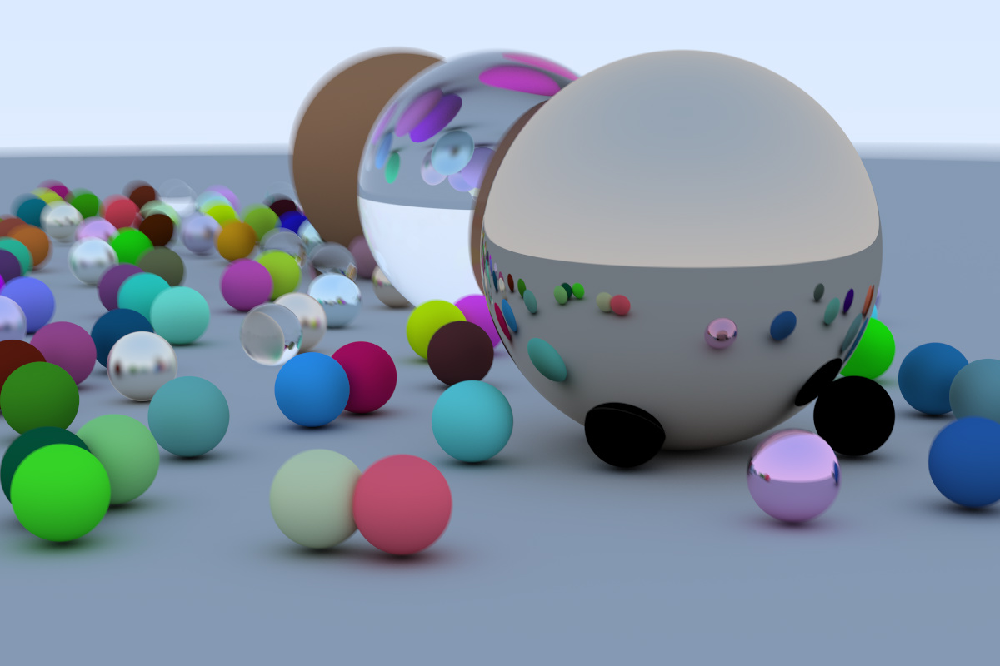
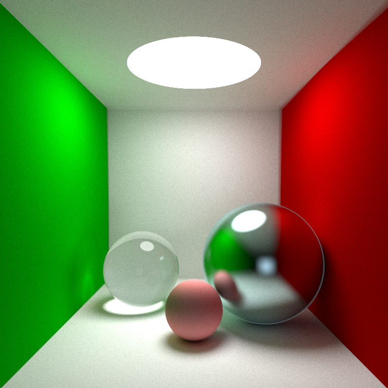
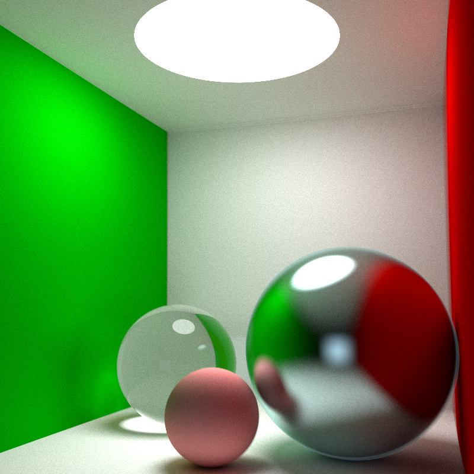
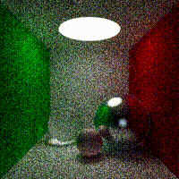
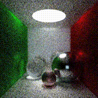

# 又一个Taichi语言的Ray Tracer

## 背景简介
这个Ray Tracer基本上是照搬了Peter Shirley的第一本小书[_Ray Tracing in One Weekend_](https://raytracing.github.io/books/RayTracingInOneWeekend.html)，在我写的时候参考的是Version 3.2.3这个版本。应该比其他中文博客删改了不少内容。果然Peter Shirley不是标题党，我在国庆期间用了2号、3号两天就写完了。期间还参考了moranzcw大佬[一年前的左右](https://forum.taichi.graphics/t/homework-0/756) (主要是抄了几个物体的定义)及其帖子下其他人的代码，在此表示感谢。

Taichi语言依附于Python，而我自己本身对Python不是那么的熟悉，更不用提Taichi了。Taichi语言的开发者带简化很多快速数值计算及并行开发的操作，但同时也增添了很多限制(比如我不知道class如何复制导致hit_record无法实现)。再加上python对OOP编程的不完全支持，我写的程序很不优雅，同时也没做足优化。

开发环境:Surface Book 2(15inch)上，使用Python 3.7.8+Taichi v0.8.1

这次写的ray tracer算是运用了太极图形课前两节除了元编程的其他所有内容，把该封装的都封装起来了。

原来以为是个小程序，所以写在了一个文件里，后来也懒得改了

与原书不同的是优化了random_in_unit_sphere()这个用来生成在单位球内随机一点的函数，在我的电脑上跑时(18fps+)与moranzcw大佬的程序(9fps+)相比大概能快两倍。(估计拥有更高配置显卡的大佬们能跑到实时吧)为此特地写了另一个程序来不同随机函数的可视化分布，顺便尝鲜了一下GGUI。

之后加入了一些键鼠操作和录制功能

除此之外还生成了一张书的封面图。不知道为什么原书中22*22个小球不能在我的电脑上生成，经过漫长的等待后，等我的只有被占用了11/15.9GB的内存，和因为使用虚拟内存而跑的飞快的硬盘，当然最后还是闪退了。
## 成功效果展示
### 封面图(有小球卡在大球里了😂)

### Cornell Box的效果


来个动图\

### 这是使用错误的随机函数导致的效果

## 使用方法
点击窗口来切换视点\
j,k键调整水平视角\
s键截图\
r键开启/终止录制
## 整体结构
```
-LICENSE
-|ouput             如果开始录制的话，视频和动图会储存在这儿
-|img               示例图片
-README.MD
-raytracing.py      本体，生成一个Cornell Box
-dots_on_sphere.py  对随机化程序的可视化
```
## 运行方式
应该都安装好taichi了吧

`python3 raytracing.py`
## 还存在的问题
- 如何优雅的ODOP编程，解决类的复制与传递
- ti.random() 如何设置随机种子
- 如何声明@ti.kernel中最外层循环串行
- 如何手动释放内存
## TODO(就写写，不一定会码)
- [x] 渲染一张封面图
- [x] 增加显式光源，渲染一个Cornell Box
- [ ] 添加其他一些模型
- [ ] 添加材质，贴图
- [ ] 加入BVH
- [ ] 加入三维模型.obj的读取与渲染，渲染一只Standford Rabbit
- [x] 增加键鼠交互
- [ ] 跟进下一本书的内容
- [ ] 在学习了之后的课程后，使用更多Taichi的特性